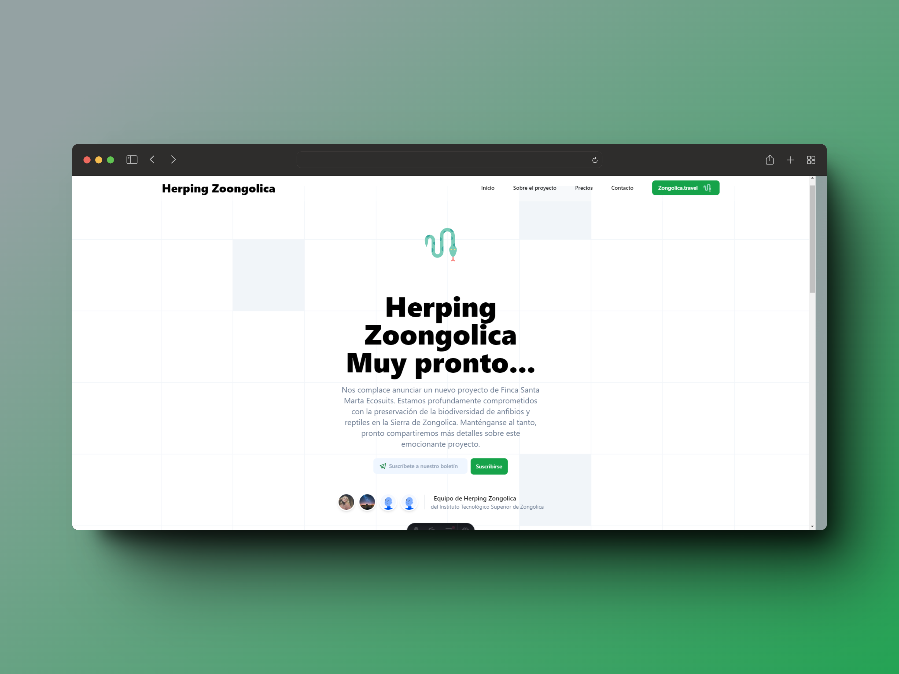

<a name="readme-top"></a>

<div align="center">

[![Contributors][contributors-shield]][contributors-url]
[![Forks][forks-shield]][forks-url]
[![Stargazers][stars-shield]][stars-url]
[![Issues][issues-shield]][issues-url]

<a href="https://github.com/Jesus-Puertos/landing-page-camping-tecnm">
  
</a>

## Landing Page del CAMPTII V5.0

CAMPTII V5.0 es un evento de campamento para la ingeniría en sistemas computacionales, a desarrollarse el dia 26 de abril del 2024 en la Unidad Académica de Tequila, Ver. Organizado por el Instituto Tecnologico Superior de Zongolica.\
[Reportar error](https://github.com/Jesus-Puertos/landing-page-camping-tecnm/issues) · [Sugerir algo](https://github.com/Jesus-Puertos/landing-page-camping-tecnm/issues)

</div>

<details>
<summary>Tabla de contenidos</summary>

1. [Características principales](#características-principales)
2. [Para empezar](#para-empezar)
   - [Prerequisitos](#prerequisitos)
   - [Instalación](#instalación)
3. [Contribuir al proyecto](#contribuir-al-proyecto)

</details>

## Características principales

- **Detalles del evento**: Obtén información detallada sobre la fecha, hora, ubicación del evento.
- **Agregar evento al calendario**: Permite a los usuarios agregar el evento a sus calendarios.
- **Redes sociales**: Conoce las redes oficiales donde podrás informarte sobre el evento.

### Capturas de pantalla de la web de CAMPTII V5.0:




<p align="right">(<a href="#readme-top">volver arriba</a>)</p>

## Para empezar

### Prerequisitos

- NPM

  ```sh
  npm install npm@latest -g
  ```

### Instalación

1. Clona el repositorio

   ```sh
   git clone https://github.com/Jesus-Puertos/landing-page-camping-tecnm.git
   ```

2. Instala los paquetes de NPM

   ```sh
   npm install
   ```

3. Ejecuta el proyecto

   ```sh
   npm run dev
   ```

<p align="right">(<a href="#readme-top">volver arriba</a>)</p>

## Contribuir al proyecto

Las contribuciones son lo que hacen que la comunidad de código abierto sea un lugar increíble para aprender, inspirar y crear. ¡Cualquier contribución que hagas es **muy apreciada**! para poder llevar a este proyecto a otro nivel.

Si tienes alguna sugerencia que podría mejorar el proyecto, por favor haz un [_fork_](https://github.com/Jesus-Puertos/landing-page-camping-tecnm/fork) del repositorio y crea una [_pull request_](https://github.com/Jesus-Puertos/landing-page-camping-tecnm/pulls). También puedes simplemente abrir un [_issue_](https://github.com/Jesus-Puertos/landing-page-camping-tecnm/issues) con la etiqueta "enhancement".

Aquí tienes una guía rápida:

1. Haz un [_fork_](https://github.com/Jesus-Puertos/landing-page-camping-tecnm/fork) del Proyecto
2. Clona tu [_fork_](https://github.com/Jesus-Puertos/landing-page-camping-tecnm/fork) (`git clone <URL del fork>`)
3. Añade el repositorio original como remoto (`git remote add upstream <URL del repositorio original>`)
4. Crea tu Rama de Funcionalidad (`git checkout -b feature/CaracteristicaIncreible`)
5. Realiza tus Cambios (`git commit -m 'Add: alguna CaracterísticaIncreible'`)
6. Haz Push a la Rama (`git push origin feature/CaracteristicaIncreible`)
7. Abre una [_pull request_](https://github.com/Jesus-Puertos/landing-page-camping-tecnm/pulls)

Por favor, consulta nuestra [guía de contribución](https://github.com/Jesus-Puertos/landing-page-camping-tecnm/blob/master/CONTRIBUTING.md) para saber cómo puedes empezar de la mejor manera y siguiendo [buenas prácticas](https://github.com/Jesus-Puertos/landing-page-camping-tecnm/blob/main/CONTRIBUTING.md#buenas-prácticas-).

#

**¡Gracias a todos los colaboradores!**

[](https://github.com/Jesus-Puertos/landing-page-camping-tecnm/graphs/contributors)

<p align="right">(<a href="#readme-top">volver arriba</a>)</p>

## 🛠️ Stack

- [![Astro][astro-badge]][astro-url] - The web framework for content-driven websites.
- [![Typescript][typescript-badge]][typescript-url] - JavaScript with syntax for types.
- [![Tailwind CSS][tailwind-badge]][tailwind-url] - A utility-first CSS framework for rapidly building custom designs.
- [![@midudev/tailwind-animations][animations-badge]][animations-url] - Easy peasy animations for your Tailwind project.

<p align="right">(<a href="#readme-top">volver arriba</a>)</p>

[astro-url]: https://astro.build/
[typescript-url]: https://www.typescriptlang.org/
[tailwind-url]: https://tailwindcss.com/
[animations-url]: https://tailwindcss-animations.vercel.app/
[astro-badge]: https://img.shields.io/badge/Astro-fff?style=for-the-badge&logo=astro&logoColor=bd303a&color=352563
[typescript-badge]: https://img.shields.io/badge/Typescript-007ACC?style=for-the-badge&logo=typescript&logoColor=white&color=blue
[tailwind-badge]: https://img.shields.io/badge/Tailwind-ffffff?style=for-the-badge&logo=tailwindcss&logoColor=38bdf8
[animations-badge]: https://img.shields.io/badge/@midudev/tailwind-animations-ff69b4?style=for-the-badge&logo=node.js&logoColor=white&color=blue
[contributors-shield]: https://img.shields.io/github/contributors/Jesus-Puertos/landing-page-camping-tecnm.svg?style=for-the-badge
[contributors-url]: https://github.com/Jesus-Puertos/landing-page-camping-tecnm/graphs/contributors
[forks-shield]: https://img.shields.io/github/forks/Jesus-Puertos/landing-page-camping-tecnm.svg?style=for-the-badge
[forks-url]: https://github.com/Jesus-Puertos/landing-page-camping-tecnm/network/members
[stars-shield]: https://img.shields.io/github/stars/Jesus-Puertos/landing-page-camping-tecnm.svg?style=for-the-badge
[stars-url]: https://github.com/Jesus-Puertos/landing-page-camping-tecnm/stargazers
[issues-shield]: https://img.shields.io/github/issues/Jesus-Puertos/landing-page-camping-tecnm.svg?style=for-the-badge
[issues-url]: https://github.com/Jesus-Puertos/landing-page-camping-tecnm/issues
